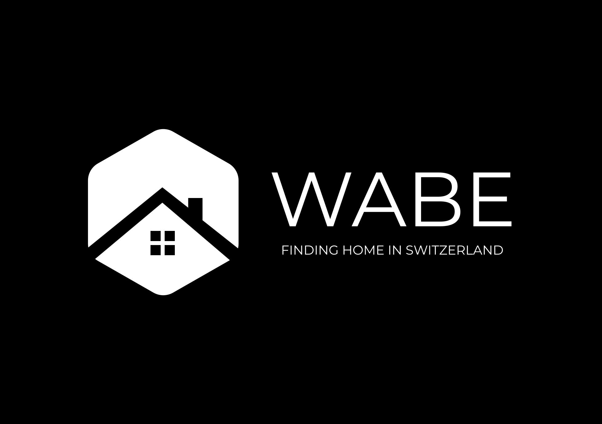
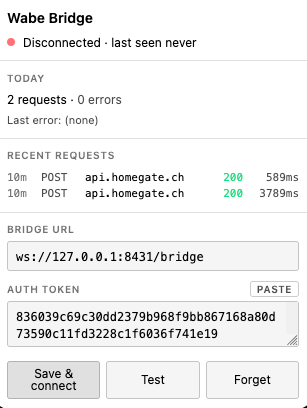

<p align="center">
  <picture>
    <source media="(prefers-color-scheme: dark)" srcset="assets/wabe-dark.svg">
    
  </picture>
</p>

> Open-source, customizable apartment scout for the Swiss market.

**Wabe** (German for *honeycomb cell*) is a self-hosted apartment hunting agent. It continuously polls listing sources, normalizes every listing into a canonical schema, scores each one against a user-defined fit profile, and pings you on Telegram when something matches.

Phases 1 + 2 (skeleton + Flatfox + Telegram notifier) are shipped. Subsequent shipped milestones:

- **Phase A — multi-source + dedup.** Five live sources (Flatfox, Homegate, ImmoScout24 sitemap, RealAdvisor, Immobilier.ch) behind a cross-source canonical-key deduper.
- **Phase B — browser bridge.** Opt-in WebExtension (Chrome + Firefox) that proxies DataDome-walled requests through a hidden tab in the user's browser, bypassing TLS/HTTP/2 + JS-challenge fingerprinting on `api.homegate.ch` and `api.immoscout24.ch`.
- **Phase B follow-up — bridge keepalive + cross-process fan-out.** Chrome offscreen-document keepalive keeps the WS warm; sibling processes (`wabe scan --source X`) dispatch through the daemon via `/dispatch` instead of failing fast.
- **Phase C — agency registry + schema.org adapter.** User-owned YAML registry of agency portals; each enabled row expands into a synthetic source plugin keyed `agency:<platform>:<id>`. Generic `@wabe/source-schemaorg` adapter handles JSON-LD-bearing sites; `wabe agencies probe|probe-portal|validate|stats` for inspection.
- **Enricher stage shipped.** Pipeline now invokes enrichers between upsert and the rental-term gate. First enricher: `@wabe/enricher-commute` — per-target × per-mode commute time via self-hosted ORS + Motis + Pelias, results consumable by filters and scoring through a new `commute(target, mode)` DSL primitive. Docker compose recipe in `docker/commute/`.

Upcoming phases (not yet implemented): LLM "vibe" scoring, a dossier vault, application drafting, and agency-portal applicators.

## The problem

Apartment hunting in Zurich is brutal: best listings get hundreds of applications within hours. Seeing listings *before* competitors, and submitting *complete, current, tailored* dossiers within hours of a listing appearing, are the two things that move the needle. Wabe is engineered around those two principles.

## Status

Phases 1, 2, A, B, B-followup, and C shipped. Five live sources + agency registry + browser bridge proven end-to-end against real Swiss portals. Not yet a production scout — LLM scoring, enrichers, and applicators are next.

## Install

```bash
git clone <repo>
cd wabe
pnpm install
pnpm build
```

Requires Node 22 (see `.nvmrc`) and pnpm 9+.

## Quickstart

```bash
pnpm wabe init       # interactive setup: writes config + .env
```

### Telegram setup

Wabe pushes every matching listing to a Telegram chat, so the notifier needs a
bot token and a chat id before `wabe scan` will do anything useful.

1. **Create a bot.** Open Telegram, search for [@BotFather](https://t.me/BotFather),
   send `/newbot`, pick a display name, then a unique username ending in `bot`.
   BotFather replies with an **HTTP API token** — copy it.

2. **Get the chat id.** Open the new bot in Telegram and tap **Start** (this
   sends `/start`). Then ask the Bot API for the latest update:

   ```bash
   curl -s "https://api.telegram.org/bot<your-token>/getUpdates?offset=-1" \
     | jq '.result[].message.chat.id'
   ```

   For a **group chat**, add the bot to the group, send any message there,
   then re-run the same `curl`. Group ids are negative (typically
   `-100…`).

3. **Wire `.env`.** In the project root, create a `.env` (gitignored) with:

   ```env
   TELEGRAM_BOT_TOKEN=<your-token>
   TELEGRAM_CHAT_ID=<your-chat-id>
   ```

   The Telegram notifier resolves these via `${env.TELEGRAM_BOT_TOKEN}` and
   `${env.TELEGRAM_CHAT_ID}` in `notifier-telegram.yaml`.

> **Security:** the bot token is a credential — anyone holding it can post
> as your bot. Never commit `.env` (it's already in `.gitignore`). If the
> token leaks, revoke it via `/revoke` in @BotFather and reissue.

### Run the pipeline

```bash
pnpm wabe scan                # one-shot scan; pings Telegram on matches
pnpm wabe start               # daemon mode; runs cron-driven scans (hosts the bridge)
pnpm wabe list                # browse persisted listings
pnpm wabe doctor              # diagnose config / DB / plugin / bridge health
pnpm wabe purge               # clear listings / scores / notifications / quota
pnpm wabe bridge pair         # print URL + token to paste into the extension
pnpm wabe bridge status       # bridge connection state (reads bridge.status.json)
pnpm wabe agencies probe URL  # classify an agency portal (platform fingerprint)
pnpm wabe agencies validate   # validate agencies.yaml against the schema
pnpm wabe login homegate      # OAuth2 + PKCE login for user-bound Homegate features
pnpm wabe logout homegate     # revoke local Homegate credentials
```

> **Homegate / ImmoScout24 notes.** These portals sit behind DataDome and
> require the browser bridge (see below). Without a paired extension the
> sources fail fast at plugin init. Anonymous public Flatfox / RealAdvisor /
> Immobilier.ch scans do not need the bridge.

### Rental-term filtering

Most Swiss portals freely mix permanent leases with furnished sublets,
Zwischenmieten, and Blueground-style serviced flats. Wabe classifies every
incoming listing as `long` / `short` / `unknown` using:

1. **Structured signals** — e.g. Flatfox `object_type === 'FURNISHED_FLAT'`.
2. **Multilingual description regex** (DE / FR / IT / EN) — `befristet`,
   `möbliert`, `auf Zeit`, `meublé`, `temporaneo`, `furnished`, `short-term`,
   `sublet`, etc. Patterns like `befristet bis 31.05.2025` also extract a
   concrete lease end date.

The orchestrator runs a pre-filter **rental-term gate** that always rejects
listings whose detected lease end date is in the past, then applies your
policy from `rental_term.yaml`:

```yaml
rental_term:
  mode: long              # 'long' | 'short'
  exclude_unknown: false  # when true, also drops unknown-term listings
```

For short-term searches, narrow the match with an optional stay window:

```yaml
rental_term:
  mode: short
  stay:
    from: 2026-06-01      # listing must be available by this date
    to:   2026-08-31      # listing must remain available through this date
    min_months: 1
    max_months: 6
```

If `rental_term.yaml` is absent the engine defaults to
`mode: long, exclude_unknown: false` — which drops the obvious furnished
or expired offers without forcing a config decision on first run. The
`wabe init` flow prompts for these settings interactively.

## Architecture

```
config.yaml + commute.yaml + agencies.yaml  →  loader  →  pipeline
                                                              ├─ Sources (flatfox, homegate, immoscout24-sitemap,
                                                              │          realadvisor, immobilier-ch, schemaorg ×N)
                                                              ├─ Canonical-key dedup (cross-source)
                                                              ├─ Enrichers (commute, …)
                                                              ├─ Rental-term gate (long/short, expiry)
                                                              ├─ Filter (hard, AND-combined)
                                                              ├─ Scorer (rule DSL, 0..100)
                                                              ├─ Quota gate (daily UTC)
                                                              └─ Notifier (telegram)

SQLite (Drizzle, FTS5) ←──── persists listings + scores + sends + commute cache
Browser bridge (127.0.0.1 WS) ←── extension-wabe proxies DataDome-walled requests
ORS + Motis + Pelias (docker) ←── @wabe/enricher-commute
```

Five plugin interfaces (`Source`, `Enricher`, `Scorer`, `Notifier`, `Applicator`); plugins are normal npm packages loaded dynamically by name from `config.yaml`'s `enabled:` list. Each plugin owns its own Zod-validated config slice.

The slice ships `Source` and `Notifier` plugins; `Enricher`, `Scorer` (LLM), and `Applicator` are type contracts only — implementations land in later phases.

## Browser bridge (optional)

Some Swiss portals (Homegate, ImmoScout24) sit behind DataDome / Cloudflare anti-bot stacks that fingerprint TLS + HTTP/2 in addition to cookies. Wabe ships an opt-in **browser bridge** that turns the user's own Chrome or Firefox into the upstream HTTPS transport, so the request goes out as ordinary human browsing.

Architecture:

- `@wabe/browser-bridge` — a `127.0.0.1`-only WebSocket server inside `wabe start`. Pairs with one extension via a 64-hex shared secret. A heartbeat file at `${dataDir}/bridge.status.json` lets sibling commands (`wabe bridge status`, `wabe doctor`) read connection state without opening a second WS client. The same server also exposes `/dispatch` so sibling processes (`wabe scan --source X`) can fan their requests through the daemon → extension instead of needing their own paired extension.
- `apps/extension-wabe` — manifest v3 WebExtension (Chrome + Firefox via separate `dist/chrome/` and `dist/firefox/` builds, since Firefox MV3 still ships with `background.service_worker` disabled and needs `background.scripts` instead). On a bridge request the extension opens (or reuses) a hidden tab loaded at the target's homepage and runs `chrome.scripting.executeScript({ world: 'MAIN' })` to perform `fetch()` inside the page's own context. This is critical: DataDome injects a JS hook on `window.fetch` that adds a fingerprint-derived header to every outgoing request — the page-context fetch picks that hook up automatically, so the request hitting api.homegate.ch looks identical to one initiated by the legitimate web app. A `declarative_net_request` rule additionally rewrites `Origin` / `Referer` at the network layer. An offscreen document (Chrome) keeps the WS warm across MV3 service-worker idle.
- `source-homegate` and `source-immoscout24-sitemap` require the bridge — either the in-process singleton (when running inside `wabe start`) or the daemon's `/dispatch` (when run as `wabe scan --source X` in a sibling process). If neither is reachable the plugin fails fast at init. IS24 additionally promotes URL-only sitemap entries to full-detail listings (rooms / price / photos / description) when the bridge is connected.

Setup:

```bash
# 1. Enable the bridge in config.yaml
#    bridge:
#      enabled: true
#      port: 8431

# 2. Build the extension (both Chrome + Firefox dists)
pnpm --filter @wabe/extension-wabe build
# Output: apps/extension-wabe/dist/chrome/ and dist/firefox/

# 3. Start the daemon (this also starts the bridge)
pnpm wabe start

# 4. Get the pairing URL + token
pnpm wabe bridge pair

# 5. Load the extension
#    Chrome:  chrome://extensions → Developer mode → Load unpacked → apps/extension-wabe/dist/chrome/
#    Firefox: about:debugging → This Firefox → Load Temporary Add-on → apps/extension-wabe/dist/firefox/manifest.json
# 6. Open the extension popup, paste URL + token, click Save & connect.

# 7. Verify
pnpm wabe bridge status     # expect: connected on port 8431 …
pnpm wabe doctor            # expect: [OK ] browser bridge — connected …
```

<p align="center">
  
</p>

Headless deployments without a GUI cannot use Homegate or ImmoScout24 — both require the paired extension. The other shipped sources (Flatfox, RealAdvisor, Immobilier.ch, schema.org agencies) work over plain undici and need no bridge.

### Known limitations

- **Chrome** uses an offscreen document to keep the WS warm across MV3 service-worker idle. **Firefox** has no offscreen API; the background event page still suspends after ~30 s and reconnects on the next `chrome.alarms` tick. For unattended Firefox runs, keep DevTools open on the background page — a Firefox-side keepalive is a deferred follow-up.
- **First request to each origin opens a new tab.** The tab is hidden (`active: false`) but visible in the tab strip. The page must reach `complete` and run any DataDome JS challenge before the bridge can dispatch; subsequent requests reuse the same tab via `chrome.tabs.query`.
- **The bridge is single-tenant.** One extension at a time per Wabe agent; a newer pairing preempts an older one server-side.
- **Distribution is unpacked-load only.** Chrome Web Store / AMO submission is a deferred follow-up.

### Cross-source lister normalisation

When the upstream response carries agency / lister metadata, source plugins now emit it under a shared shape so downstream tooling (UI, dedup, notifier templates) can treat every source the same way:

- `agency`: top-level string — legal/agency name.
- `contact`: strict `{ phone?, email?, form_url? }` — schema-validated.
- `enriched.lister`: source-specific richness (`legal_name`, `website`, `logo_url`, `inquiry_contact`, `viewing_contact`, `address_locality`, …) — schema-passthrough.
- `location.region`, `location.neighborhood`, `available_from`: filled from raw response when available.

Implemented for `source-homegate`, `source-flatfox`, `source-realadvisor`. Other sources continue to emit `null` / `{}` where the data isn't exposed by the upstream API.

## Plugin authoring 101

A plugin is an npm package that default-exports `{ kind, plugin }`:

```ts
import { z } from 'zod';
import type { Source } from '@wabe/plugin-sdk';

const ConfigSchema = z.object({ schedule: z.string().default('*/5 * * * *') });

const plugin: Source = {
  name: 'my-source',
  configSchema: ConfigSchema,
  async *fetch(ctx) {
    // yield RawListing objects
  },
};

export default { kind: 'source' as const, plugin };
```

See `plugins/source-flatfox/` for a complete reference implementation, and
`plugins/source-homegate/` for a more involved one (bridge-driven transport,
iOS-style headers, Auth0 + PKCE login for user-bound features).

## Roadmap

See [`.planning/notes/spec.md`](./.planning/notes/spec.md) for the full spec and the out-of-slice items that become subsequent specs.

## Contributing

PRs welcome on bugs and small enhancements. Open an issue first for anything large. The plugin SDK is intentionally small — new sources / notifiers / enrichers belong in their own packages, not in the core.

## License

AGPL-3.0. See [`LICENSE`](./LICENSE).
